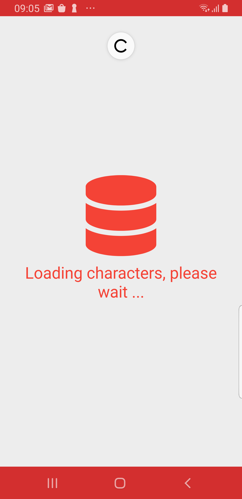
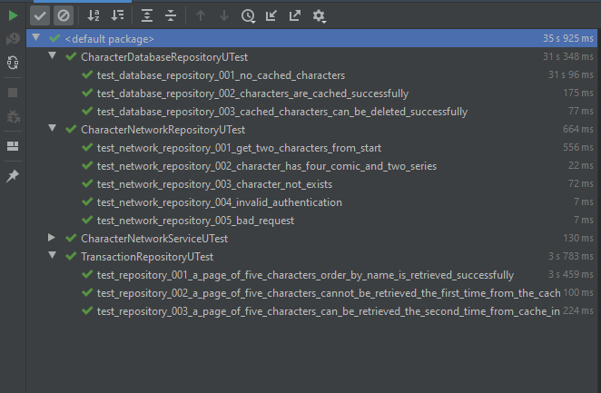

# Android Mobile Test

## Main Goals

* Clean architecure approach.
* Dependency injection through Dagger.
* Asynchronous operations management with cooroutines.
* Using Material Design guidelines.
* Using local storage to implement cache layer through repository pattern.
* Testing with mockito, assertj, junit..

## Possible improvements.

* Using the Jetpack Paging library.
* UI Testing.

## Screenshots

### Character List

### Character Detail

## Tests

